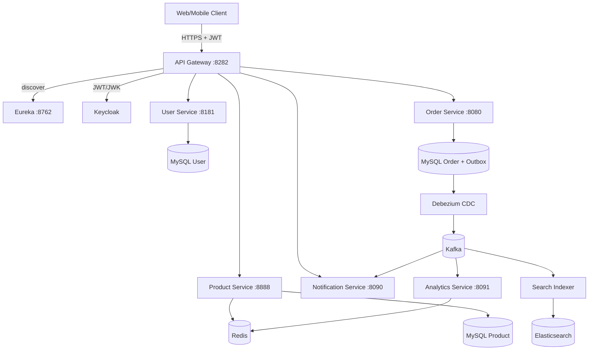
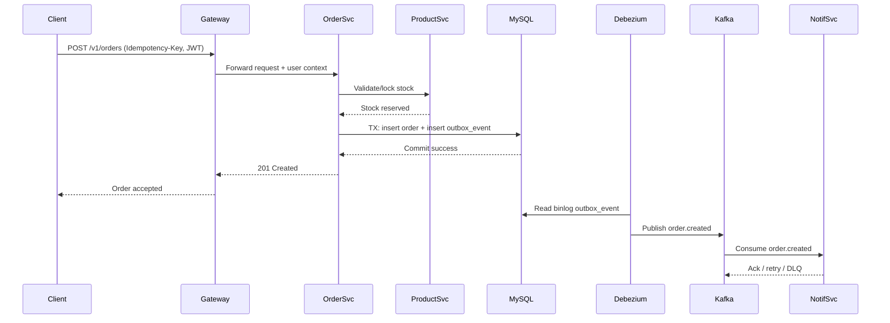
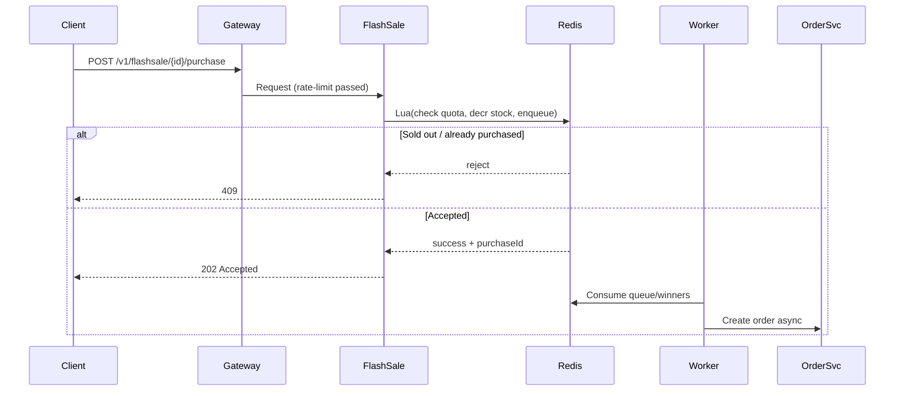
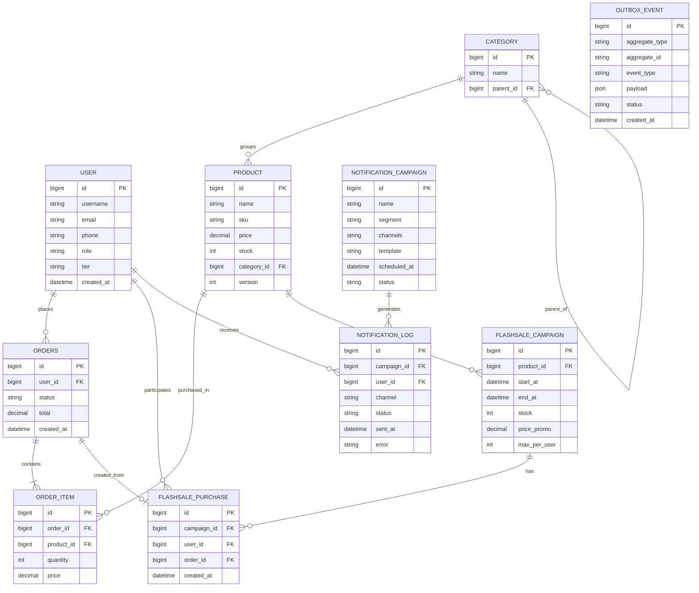

# System Architecture — ECommerce Platform Microservices

---

## 1. Pattern Selection

| Pattern                  | Selected? | Justification                                                                                          |
|--------------------------|-----------|--------------------------------------------------------------------------------------------------------|
| API Gateway              | ✅        | Single entrypoint for routing, JWT validation, rate limiting, and trace propagation                  |
| Service Discovery        | ✅        | Services register to Eureka; gateway routes via `lb://service-name`                                  |
| Message Queue            | ✅        | Kafka decouples services and supports async/event-driven workflows                                    |
| Outbox Pattern           | ✅        | Business write + outbox write in same transaction to avoid lost events                               |
| CDC (Debezium)           | ✅        | Reads MySQL binlog and publishes outbox events to Kafka reliably                                      |
| Saga (Choreography)      | ✅        | Distributed transaction flow across order/stock/payment with compensating events                      |
| Distributed Caching      | ✅        | L1 Caffeine + L2 Redis for low-latency product reads                                                  |
| Distributed Locking      | ✅        | Redisson lock protects stock-critical sections                                                         |
| Rate Limiting            | ✅        | Redis + Lua at gateway for per-user/per-IP throttling, especially flash-sale endpoints               |
| Idempotency              | ✅        | `Idempotency-Key` stored with Redis `SETNX` to prevent duplicate POST processing                      |
| Dead-Letter Queue        | ✅        | Kafka DLQ isolates failed notification/event processing after max retries                             |
| CQRS (partial)           | ✅        | Order history/read model separated from write path where needed                                       |
| Circuit Breaker          | ✅        | Resilience4j protects downstream dependencies and supports graceful degradation                        |
| Event Sourcing           | ❌        | Not required end-to-end; event log retained in Kafka, but source of truth remains MySQL              |
| Central Orchestrator Saga| ❌        | SRD selects choreography over a centralized orchestrator                                               |

---

## 2. System Components

| Component                | Responsibility                                                                 | Tech Stack                         | Port |
|--------------------------|--------------------------------------------------------------------------------|------------------------------------|------|
| **API Gateway**          | AuthN/AuthZ validation, rate limit, routing, trace headers                   | Spring Cloud Gateway, WebFlux      | 8282 |
| **Eureka Server**        | Service registry/discovery                                                     | Spring Cloud Netflix Eureka        | 8762 |
| **Auth Service**         | Login/register/token integration with Keycloak                                | Spring Boot, OAuth2/OIDC           | 8189 |
| **User Service**         | User CRUD and profile data                                                     | Spring Boot, MySQL                 | 8181 |
| **Product Service**      | Product CRUD, stock lock, cache tiers                                         | Spring Boot, Redis, Redisson, Kafka| 8888 |
| **Order Service**        | Create/cancel orders, outbox write, order lifecycle                           | Spring Boot, MySQL, Kafka, Redis   | 8080 |
| **Notification Service** | Fan-out processing (email/push/SMS), retry, DLQ                               | Spring Boot, Kafka                 | 8090 |
| **Analytics Service**    | Stream aggregation (orders/sec, GMV), dashboard push                          | Kafka Streams, WebSocket, Redis    | 8091 |
| **Search Indexer**       | Consume CDC/event stream and index documents                                  | Spring Boot, Kafka, Elasticsearch  | —    |
| **Keycloak**             | Identity provider, JWT issuance, role management                              | Keycloak 24.x                      | 8081 |
| **MySQL (per-service)**  | Transactional persistence + outbox tables                                     | MySQL 8.x                          | 3306 |
| **Redis**                | Cache, lock, flash-sale counters, rate limit, idempotency                     | Redis 7.x                          | 6379 |
| **Kafka Cluster**        | Event bus, async decoupling, replay, DLQ                                      | Kafka 3.x                          | 9092 |
| **Elasticsearch**        | Product search and analytics logs/indexes                                     | Elasticsearch 8.x                  | 9200 |

### Cross-Cutting Components

| Component                | Responsibility                                                                 |
|--------------------------|--------------------------------------------------------------------------------|
| **OpenTelemetry SDK**    | Trace/span collection and propagation across HTTP + Kafka                      |
| **Prometheus + Grafana** | Metrics scraping and SLO dashboard                                             |
| **Jaeger**               | Distributed tracing UI                                                         |
| **Logstash/Loki**        | Centralized log pipeline and indexing                                          |

---

## 3. Communication

### Component Communication

| From                     | To                    | Protocol        | Description                                                    |
|--------------------------|-----------------------|-----------------|----------------------------------------------------------------|
| Client                   | API Gateway           | HTTPS/REST      | All external requests enter via gateway                        |
| API Gateway              | Eureka Server         | HTTP            | Service lookup for `lb://` routing                             |
| API Gateway              | Keycloak              | OIDC/JWK        | JWT issuer/signature validation                                |
| API Gateway              | Core Services         | HTTP/REST       | Forward requests with `X-Trace-Id`, `X-User-Id`                |
| Product Service          | Redis                 | Redis protocol  | L2 cache, stock counter, lock keys                             |
| Order Service            | Product Service       | HTTP/REST       | Validate/reserve stock flow                                    |
| Order Service            | MySQL                 | JDBC            | Persist order + outbox in one transaction                      |
| Debezium Connector       | MySQL                 | Binlog CDC      | Capture outbox changes                                          |
| Debezium Connector       | Kafka                 | Kafka protocol  | Publish `order.created`, domain events                          |
| Notification Service     | Kafka                 | Kafka protocol  | Consume campaign/events; retry and DLQ                          |
| Analytics Service        | Kafka                 | Kafka protocol  | Aggregate stream events to metrics                              |
| Search Indexer           | Kafka                 | Kafka protocol  | Consume product/order changes for indexing                      |
| Search Indexer           | Elasticsearch         | HTTP/REST       | Upsert documents for search/trending                            |

### Topic / Key Design

| Topic / Key                  | Producer                  | Consumer                    | Purpose                                      |
|-----------------------------|---------------------------|-----------------------------|----------------------------------------------|
| `order.created`             | Debezium (from outbox)    | Notification, Analytics     | Order lifecycle event                         |
| `flash-sale.evt`            | Flash-sale worker/service | Analytics, Notification     | Flash-sale operational events                 |
| `notif.campaign`            | Notification scheduler    | email/push/sms workers      | Fan-out workload distribution                 |
| `notif.dlq`                 | Notification workers      | Admin replay tooling        | Failed notifications after max retries        |
| `product.updated`           | Product service           | Cache invalidator/indexer   | Cache invalidation + search sync              |
| `idem:{key}` (Redis)        | Gateway/services          | Gateway/services            | POST deduplication response cache             |
| `flashsale:{id}:stock`      | Flash-sale service        | Flash-sale purchase flow    | Atomic stock counter                          |

---

## 4. Architecture Diagram

### Component Diagram

### Order + Outbox + CDC Flow

### Flash-Sale Purchase Flow (Atomic Redis)

---

## 5. Deployment

- Local development target: Docker Compose for infra and service containers
- Runtime target: Kubernetes for horizontal scaling and HA
- Services are stateless and scale independently
- Data stores are externalized (MySQL/Redis/Kafka/Elasticsearch/Keycloak)

### Services

| Service                | Image (example)                    | Depends On                              |
|------------------------|------------------------------------|------------------------------------------|
| `eureka-server`        | `ecommerce/eureka-server:latest`   | —                                        |
| `api-gateway`          | `ecommerce/api-gateway:latest`     | Eureka, Keycloak, Redis                  |
| `auth-service`         | `ecommerce/auth-service:latest`    | Keycloak, Eureka                         |
| `user-service`         | `ecommerce/user-service:latest`    | MySQL, Eureka                            |
| `product-service`      | `ecommerce/product-service:latest` | MySQL, Redis, Kafka, Eureka              |
| `order-service`        | `ecommerce/order-service:latest`   | MySQL, Redis, Kafka, Product, Eureka     |
| `notification-service` | `ecommerce/notification:latest`    | Kafka, MySQL, Eureka                     |
| `analytics-service`    | `ecommerce/analytics:latest`       | Kafka, Redis                             |
| `search-indexer`       | `ecommerce/search-indexer:latest`  | Kafka, Elasticsearch                     |
| `keycloak`             | `quay.io/keycloak/keycloak:24`     | MySQL/Postgres for realm storage         |
| `mysql`                | `mysql:8`                          | —                                        |
| `redis`                | `redis:7`                          | —                                        |
| `kafka`                | `bitnami/kafka:3`                  | Zookeeper/KRaft controller               |
| `elasticsearch`        | `docker.elastic.co/elasticsearch/elasticsearch:8.x` | —                         |

### Startup Order (Recommended)

1. Data and infra: `mysql`, `redis`, `kafka`, `keycloak`, `elasticsearch`
2. Discovery: `eureka-server`
3. Edge and identity integration: `api-gateway`, `auth-service`
4. Core domain: `user-service`, `product-service`, `order-service`
5. Async processors: `notification-service`, `analytics-service`, `search-indexer`

### Scaling Path

- Scale API/Gateway by HTTP RPS
- Scale `order-service`/`product-service` by CPU + latency SLO
- Scale Kafka consumers (`notification`, `analytics`, `indexer`) by partition lag
- Scale Redis/Kafka/MySQL using cluster/replica topology defined in SRD

---

## 6. ERD (Data Model Relationships)

### Logical ERD

### Notes

- `OUTBOX_EVENT` is written in the same transaction as business entities (for example `ORDERS`) and then exported by CDC to Kafka.
- `CATEGORY.parent_id` models hierarchical categories (self-reference).
- `FLASHSALE_PURCHASE.order_id` may be nullable until async order creation finishes.
- Physical deployment uses per-service databases; ERD above is a logical domain view for cross-service understanding.
